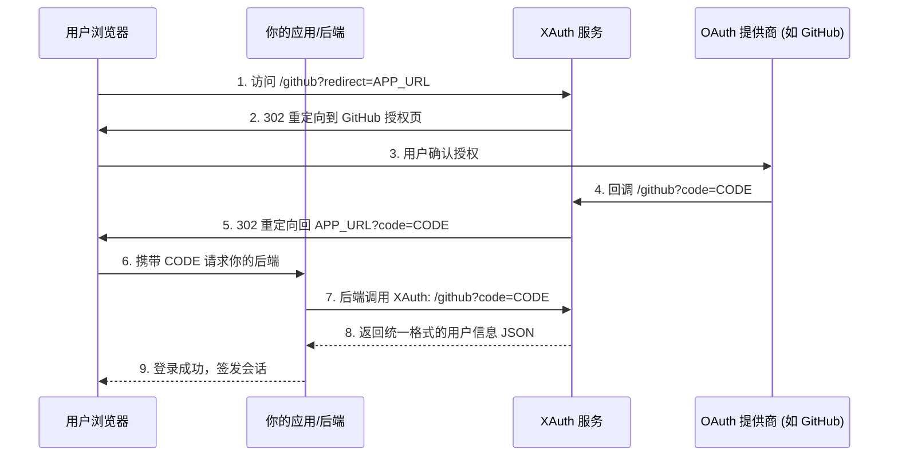

# XAuth

🚀 高性能 OAuth 2.0 认证中转服务，基于 Rust + Axum 构建。

XAuth 旨在提供一个统一、轻量且安全的 OAuth 2.0 认证中转方案，支持国内外主流社交平台及标准 OIDC 协议。它可以作为独立服务运行，为前端应用或后端服务提供统一的用户信息聚合接口。

## 🌟 核心特性

- **多平台支持**：内置 GitHub, Google, X (Twitter), 微博, QQ, 华为及标准 OIDC 支持。
- **配置驱动**：采用 TOML 格式配置文件，支持环境变量覆盖，部署灵活。
- **自动发现**：支持 OIDC Discovery 协议，简化 OpenID Connect 配置。
- **安全性**：原生支持 PKCE (Proof Key for Code Exchange) 流程，适配最新安全标准。
- **极致性能**：基于 Rust 异步生态（Tokio + Reqwest），内存占用极低。
- **Waline 兼容**：完美对齐 Waline 评论系统的认证需求，支持特定的 User-Agent 处理。
- **智能显示**：首页接口仅展示已正确配置（`client_id` 不为空）的可选登录渠道。

## 🚀 快速开始

### 1. 准备配置文件（可选）

创建 `config.toml`（可选，若不存在将使用默认配置）：

```toml
[server]
# 监听地址（默认 0.0.0.0）
host = "0.0.0.0"
# 监听端口（默认 3000，也可通过 PORT 环境变量覆盖）
port = 3000
# 调试模式（默认 false，也可通过 DEBUG 环境变量覆盖）
debug = true

# 服务的外部访问地址（可选，用于 OAuth 回调地址等，可通过 SERVER_URL 环境变量覆盖）
# server_url = "http://xauth.example.com"

[providers.github]
client_id = "your_client_id"
client_secret = "your_client_secret"

[providers.weibo]
client_id = "your_client_id"
client_secret = "your_client_secret"
```

### 2. 运行服务

```bash
# 开发运行
RUST_LOG=info cargo run

# 生产构建
cargo build --release
./target/release/xauth
```

### 3. 应用创建指南

| 提供商 | 控制台地址 | 默认回调地址 (Callback URL) |
|--------|-----------|---------------------------|
| **GitHub** | [Developer Settings](https://github.com/settings/developers) | `http://your-domain.com/github` |
| **X (Twitter)**| [Developer Portal](https://developer.x.com/) | `http://your-domain.com/twitter` |
| **Google** | [Cloud Console](https://console.cloud.google.com/apis/credentials) | `http://your-domain.com/google` |
| **微博** | [微博开放平台](https://open.weibo.com/connect) | `http://your-domain.com/weibo` |
| **QQ** | [QQ 开放平台](https://connect.qq.com/) | `http://your-domain.com/qq` |
| **华为** | [开发者联盟](https://developer.huawei.com/consumer/cn/service/josp/agc/index.html) | `http://your-domain.com/huawei` |

## 🛠 配置说明

### 配置优先级

项目支持多种配置方式，优先级为： **环境变量 (`export`) > config.toml > 默认值**

- **config.toml**：项目根目录下的配置文件（可选，不存在时使用默认值）
- **环境变量**：最高优先级，可覆盖 config.toml 中的值
- **默认值**：当 config.toml 不存在或配置项缺失时使用（如 `PORT` 默认 `3000`，`host` 默认 `0.0.0.0`）

#### 1. 仅使用环境变量（推荐用于生产环境）

无需任何配置文件，直接通过环境变量启动：

```bash
export GITHUB_ID="your_client_id"
export GITHUB_SECRET="your_client_secret"
export PORT=3000
export DEBUG=false
./xauth
```

#### 2. config.toml + 环境变量覆盖（推荐用于开发环境）

先创建 `config.toml`，再通过环境变量覆盖特定配置：

```bash
cp config.toml config.toml.bak  # 备份
export PORT=8080  # 覆盖默认的 3000
./xauth
```

#### 3. .env 文件（仅用于本地开发）

在本地开发时，推荐使用 `.env` 文件来管理配置：
1. 将 `.env.example` 复制一份并重命名为 `.env`：
   ```bash
   cp .env.example .env
   ```
2. 编辑 `.env` 文件，填入你的 `Client ID` 和 `Client Secret` 等敏感信息。
3. **注意**：`.env` 文件包含敏感凭证，**严禁提交到 git 仓库**。

### 环境变量映射

除 `config.toml` 外，你还可以通过环境变量快速覆盖配置：

#### 基础配置
| 配置项 | 环境变量 | 说明 |
|--------|----------|------|
| server.port | `PORT` | 监听端口（默认 `3000`）|
| server.host | - | 监听地址（默认 `0.0.0.0`，仅在 config.toml 中配置）|
| server.server_url | `SERVER_URL` | 服务的外部访问地址（可选，用于 OAuth 回调等）|
| server.debug | `DEBUG` | 开启/关闭调试模式 (`true`/`1`) |

#### 提供商配置 (Client ID & Secret)
| 提供商 | ID 变量 | Secret 变量 |
|--------|---------|-------------|
| **GitHub** | `GITHUB_ID` | `GITHUB_SECRET` |
| **Google** | `GOOGLE_ID` | `GOOGLE_SECRET` |
| **X (Twitter)** | `X_ID` 或 `TWITTER_ID` | `X_SECRET` 或 `TWITTER_SECRET` |
| **微博** | `WEIBO_ID` | `WEIBO_SECRET` |
| **QQ** | `QQ_ID` | `QQ_SECRET` |
| **华为** | `HUAWEI_ID` | `HUAWEI_SECRET` |
| **OIDC** | `OIDC_ID` | `OIDC_SECRET` |

#### OIDC & 高级覆盖
| 配置项 | 环境变量 | 说明 |
|--------|----------|------|
| oidc.issuer | `OIDC_ISSUER` | OIDC 发行者 URL |
| {name}.scopes | `{NAME}_SCOPES` | 覆盖权限范围 (如 `GITHUB_SCOPES`) |
| {name}.auth_url | `{NAME}_AUTH_URL` | 显式指定授权地址 |
| {name}.token_url | `{NAME}_TOKEN_URL` | 显式指定令牌地址 |
| {name}.userinfo_url | `{NAME}_USERINFO_URL` | 显式指定用户信息地址 |

> **提示**：只有在配置了 `client_id` 且不为空的提供商（无论来自 `config.toml` 还是环境变量），才会在 `/` 接口中显示并可用。

### OIDC 配置示例

OIDC 支持通过 `issuer` 自动发现（推荐）或显式指定端点：

```toml
[providers.oidc]
client_id = "xxx"
client_secret = "xxx"
# 自动发现模式
issuer = "https://accounts.google.com"
# 显式指定模式 (可选)
# auth_url = "..."
# token_url = "..."
# userinfo_url = "..."
scopes = "openid profile email"
```

## 🔌 对接指南

### 1. 前端跳转 (重定向模式)

这是最常用的模式。用户点击登录后跳转到 XAuth，认证成功后带 `code` 返回你的应用。

```html
<a href="https://xauth.example.com/github?redirect=https://your-app.com/callback">
  GitHub 登录
</a>
```

认证完成后，浏览器将跳转至：
`https://your-app.com/callback?code=授权码&state=状态值`

### 2. 获取用户信息 (JSON 模式)

如果请求中没有 `redirect` 参数，或者 User-Agent 为 `@waline`，服务将直接返回用户信息 JSON。

**请求：**
`GET /github?code=授权码`

**响应：**
```json
{
  "id": "12345",
  "name": "张三",
  "email": "zhangsan@example.com",
  "url": "https://github.com/zhangsan",
  "avatar": "https://avatars.example.com/u/12345"
}
```

### 3. 认证流程图



## 📝 API 概览

- `GET /`：获取服务信息及当前可用的登录渠道列表。
- `GET /{provider}`：根据是否有 `code` 参数，执行“发起重定向”或“处理回调并换取用户信息”逻辑。
- `GET /wb_{domain}.txt`：支持微博域名所有权验证。

## 👨‍💻 开发与测试

```bash
# 运行单元测试
cargo test

# 检查代码质量
cargo check
```

## 📜 许可证

[Apache-2.0 License](LICENSE)

## 🤝 参考项目

- [walinejs/auth](https://github.com/walinejs/auth) - 原版 Node.js 实现
